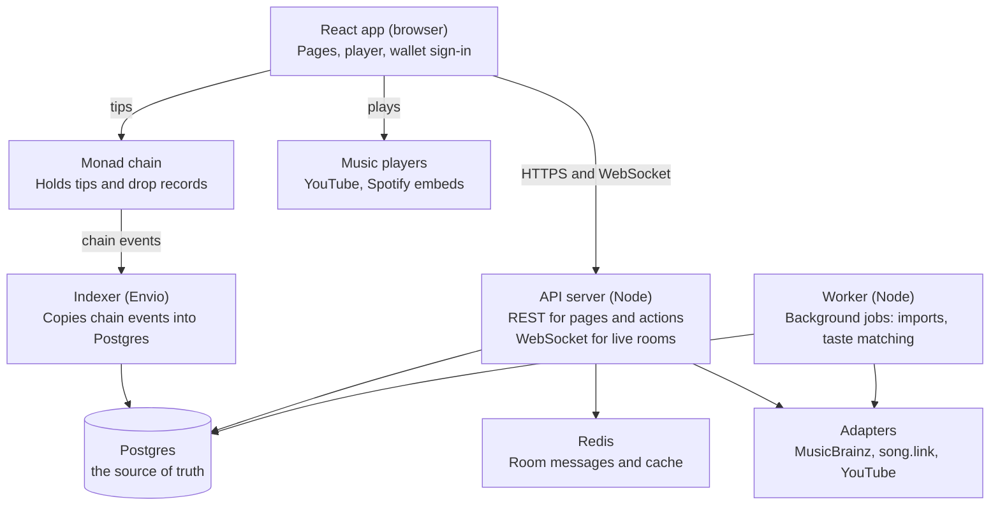
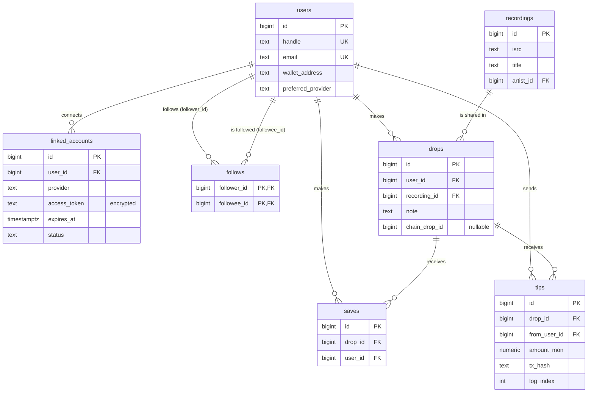
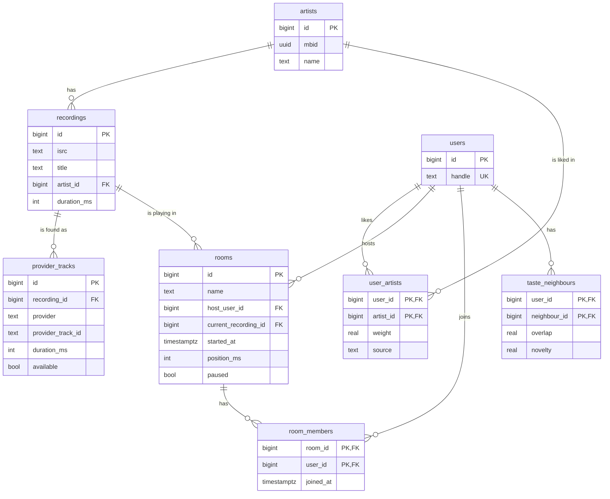
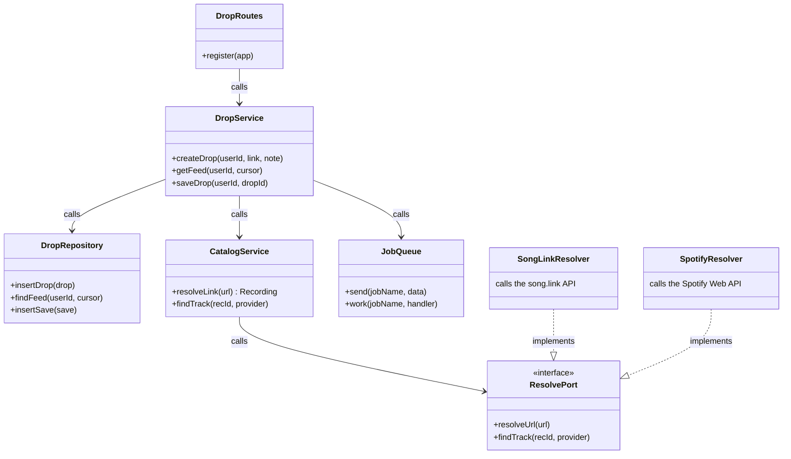
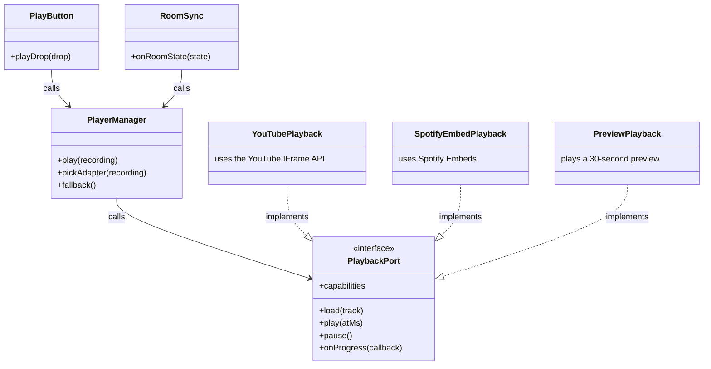
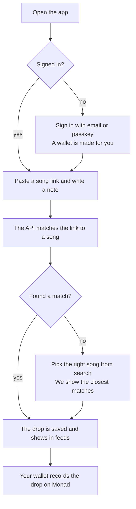
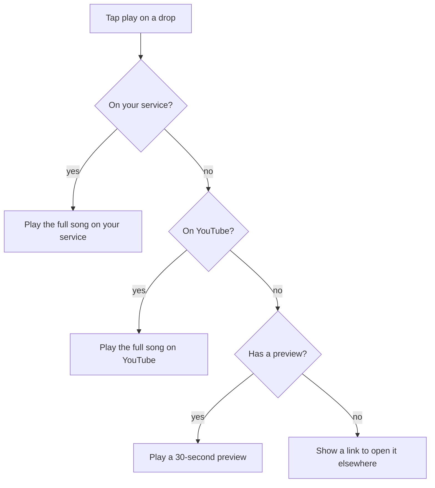
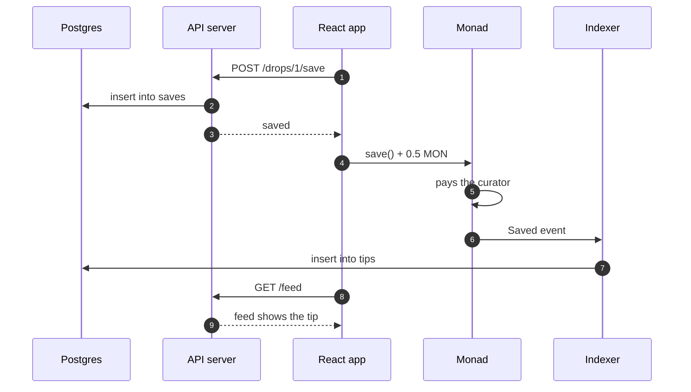

# Aux

Aux is a platform where music fans share songs they love and find new music through people with interesting taste. A user posts a song with a short note on why it hits (a **drop**), other users play it, save it, and can send the person who shared it a small tip.

This README is also the project's architecture guide. It is carefully drafted for smoother onboarding.

## Contents

1. [Start here](#start-here)
2. [Glossary](#glossary)
3. [Tech stack](#tech-stack)
4. [The big picture](#the-big-picture)
5. [Folder layout](#folder-layout)
6. [Database tables](#database-tables)
7. [ERD: how the tables connect](#erd-how-the-tables-connect)
8. [Class diagrams](#class-diagrams)
9. [User flows](#user-flows)
10. [API endpoints and WebSocket messages](#api-endpoints-and-websocket-messages)
11. [The onchain part](#the-onchain-part)
12. [Your first day](#your-first-day)

---

## Start here

We never store or stream audio ourselves. Songs play inside the browser through services people already use, like YouTube or Spotify. Tips are paid on the Monad blockchain.

**Who this is for:** any developer joining the project. No blockchain experience is needed to work on most of the code.

**How to read it:** read [Start here](#start-here) to [The big picture](#the-big-picture) first (about 15 minutes). After that, jump to the section for the part you are working on.

**Three rules the whole codebase follows:**

1. The core of the app never talks to a music service directly. It always goes through an **adapter**, so any service can be added or removed without touching the rest of the code.
2. Postgres is the source of truth. Redis only holds things we can rebuild, so losing Redis never loses data.
3. Money and song drops live on Monad. Everything else lives in Postgres.

All sample data in this guide is made up for illustration, including IDs, emails and wallet addresses.

---

## Glossary

These words show up everywhere in the code, the database and this guide. Learn them first.

| Word | What it means | Example |
| --- | --- | --- |
| Drop | A song a user shares, plus a short note on why | "Konko Below by Lagbaja. Wait for the sax." |
| Curator | The user who made a drop | Femi made the drop above, so Femi is its curator |
| Recording | One song in our own catalog, not tied to any music service | Radiohead, "Weird Fishes" |
| ISRC | A 12-character code the music industry gives each recording. We use it to find the same song on different services | GBAYE0700123 (made up) |
| Provider | An outside music service or music data source | YouTube, Spotify, Apple Music, MusicBrainz |
| Port | A TypeScript interface that says what an adapter must be able to do | `PlaybackPort` needs `play()` and `pause()` |
| Adapter | A class that makes one provider fit one port | `YouTubePlayback` implements `PlaybackPort` |
| Save | A user adds a drop to their collection, usually someone else's | Ada saves Femi's Lagbaja drop |
| Tip | A small payment sent with a save, paid on Monad to the curator | 0.5 MON to Femi |
| Room | A live listening session where everyone hears the same song at the same time | "Friday night Afrobeat" room |
| Taste neighbour | A user whose taste overlaps with yours enough to be interesting | You share 30% of artists with Tunde |
| Job | A task the worker runs in the background, outside a web request | "Import Ada's listening history" |
| Indexer | A program that reads events from Monad and copies them into Postgres | A new tip on Monad becomes a row in `tips` |

---

## Tech stack

The whole project is written in TypeScript: a React app in the browser, a Node.js API server and worker, Postgres for data and Redis for fast messages. One language everywhere means types are shared between the frontend and backend, and anyone can work on any part.

### Frontend (runs in the browser)

| Technology | What it does here | Why this one |
| --- | --- | --- |
| React + TypeScript | Builds every screen | The most widely known UI library, so help and hires are easy to find |
| Vite | Runs the app locally and builds it for production | Starts in under a second and needs almost no setup. We don't need server rendering, so Next.js would add weight for nothing |
| React Router | Moves between pages like `/feed` and `/drops/42` | The standard router for React apps |
| TanStack Query | Fetches data from the API, caches it and keeps it fresh | Removes most hand-written loading and error code |
| Zustand | Holds app-wide state like "which song is playing now" | Much smaller and simpler than Redux |
| Tailwind CSS | Styling | Styles live next to the markup, so there are no separate CSS files to hunt through |
| Privy SDK | Sign-in with email or passkey, and a wallet made for each user behind the scenes | Users never see a seed phrase. Dynamic is a drop-in alternative |
| viem | Sends tip transactions to Monad | Small, typed and the modern standard for talking to EVM chains |

### Backend (runs on our servers)

| Technology | What it does here | Why this one |
| --- | --- | --- |
| Node.js (LTS) | Runs the API server and the worker | Same language as the frontend |
| Fastify | The web framework for our REST API | Faster than Express, with built-in request validation and good TypeScript support |
| ws | WebSocket connections for live rooms | A plain, well-tested library. We don't need Socket.IO's extras |
| Zod | Checks that incoming data has the right shape | One schema gives both a runtime check and a TypeScript type |
| Drizzle ORM | Reads and writes Postgres from TypeScript | Queries look like SQL, so you learn real SQL while using it. Types come straight from the tables |
| pg-boss | Runs background jobs, stored in Postgres | No extra system to run, and a job can be saved in the same transaction as the data that created it |

### Data

| Technology | What it does here | Why this one |
| --- | --- | --- |
| PostgreSQL | Stores everything that matters | Relational data (users, follows, drops, saves) fits tables and joins perfectly |
| Redis | Passes live room messages between servers, caches lookups, counts requests for rate limits | Very fast, and everything in it can be rebuilt from Postgres |

### Outside services (reached only through adapters)

| Technology | What it does here |
| --- | --- |
| YouTube IFrame Player API | Plays full songs for anyone, no account needed. Our first playback adapter |
| Spotify Embeds, Apple MusicKit JS | Extra playback adapters for users of those services |
| MusicBrainz API | Free, open song and artist data. Gives us IDs that group versions of the same song |
| song.link (Odesli) API | Turns a link from any service into the same song on other services |

### Onchain

| Technology | What it does here |
| --- | --- |
| Monad (testnet first) | The blockchain that records drops and carries tips. It is EVM-compatible, so normal Ethereum tools work |
| Solidity + Foundry | Writing, testing and deploying the smart contract |
| Envio | The indexer that copies contract events into Postgres |

### Tooling and hosting

| Technology | What it does here |
| --- | --- |
| pnpm workspaces | Keeps the web app, server and contracts in one repository with shared code |
| Docker Compose | Starts Postgres and Redis on your laptop with one command |
| Vitest, Playwright | Unit tests, and browser tests that click through real flows |
| ESLint + dependency-cruiser | Code style, and a check that modules only use each other's public parts |
| Sentry, OpenTelemetry | Error reports and request tracing |
| Static host (e.g. Cloudflare Pages), Fly.io or Render, Neon, Upstash | Hosting for the React app, the Node servers, Postgres and Redis |

---

## The big picture

The app has three programs we write (the React app, the API server and the worker) plus a small indexer. All of them keep their data in one Postgres database.



The browser never talks to Postgres or Redis directly; it always goes through the API server. Songs play straight from the music service inside the browser, so our servers never carry audio.

**What each program does**

- **React app:** everything the user sees. It calls the API for data, plays songs through a music player adapter and sends tips to Monad from the user's wallet.
- **API server:** answers requests like "give me my feed" or "create this drop", and runs live rooms over WebSocket. It must answer fast, so slow work goes to the worker.
- **Worker:** runs background jobs, like importing a user's listening history or recalculating taste neighbours every night. If a job fails, it retries it later.
- **Indexer:** watches the Monad contract. When a tip or drop happens onchain, it writes a matching row in Postgres so the feed can show it.

### The ports-and-adapters idea, in plain words

Think of a travel plug adapter. Your laptop (our core code) has one kind of plug. Each country (each music service) has a different socket. Instead of rebuilding the laptop for every country, you carry small adapters.

In code, a **port** is an interface such as `PlaybackPort`. An **adapter** is a class such as `YouTubePlayback` that implements it. Drops, rooms and taste code only ever call the port, so they work the same whichever service is behind it. Adding a new music service means writing one new adapter class and nothing else.

---

## Folder layout

Everything lives in one repository. The API server and the worker share one codebase with two starting files, so they use the same database code and modules.

```
aux/
├── apps/
│   ├── web/                    React app (Vite)
│   │   └── src/
│   │       ├── pages/          One file per screen: FeedPage, DropPage, RoomPage, ProfilePage
│   │       ├── components/     Reusable pieces: DropCard, PlayButton, TipButton
│   │       ├── player/         PlaybackPort and its adapters (youtube.ts, spotify.ts)
│   │       ├── api/            TanStack Query hooks that call the API
│   │       └── stores/         Zustand stores (now playing, current room)
│   ├── server/                 API server + worker (Node)
│   │   └── src/
│   │       ├── main-api.ts     Starts the API server
│   │       ├── main-worker.ts  Starts the worker
│   │       ├── modules/        identity/ catalog/ drops/ rooms/ taste/
│   │       ├── ports/          Interfaces: ResolvePort, ImportPort, AuthPort
│   │       ├── adapters/       musicbrainz/ songlink/ spotify/ lastfm/ privy/
│   │       ├── jobs/           Background job handlers for pg-boss
│   │       └── db/             schema.ts (Drizzle tables) and migrations/
│   └── indexer/                Envio config and event handlers
├── packages/
│   └── shared/                 Types and Zod schemas used by both web and server
├── contracts/                  Foundry project: src/Curation.sol, test/, script/
├── docs/adr/                   One short file per big decision (why we chose X)
└── docker-compose.yml          Local Postgres and Redis
```

**Inside every backend module** you will find the same four files. Once you know one module, you know them all.

| File | Job | Example from `drops/` |
| --- | --- | --- |
| `routes.ts` | Turns HTTP requests into service calls. No business rules here | `POST /drops` calls `dropService.create()` |
| `service.ts` | The business rules | "A user can't drop the same song twice in one day" |
| `repository.ts` | The only file that talks to Postgres | `insertDrop()`, `findFeedForUser()` |
| `index.ts` | What other modules may use. Everything else is private | Exports `DropService`, not the repository |

A request always moves in one direction: **route → service → repository → Postgres**. If you catch yourself writing SQL in a route, move it to the repository.

---

## Database tables

We have 14 tables, grouped below by the module that owns them. Only the owning module's `repository.ts` may write to its tables.

**How to read these:** each header shows the column name and its type. PK means primary key (the row's unique ID). FK means foreign key (it points at a row in another table). Every table also has a `created_at` column, left out here to save space. Long IDs and hashes are shortened with "…".

### Identity module

**users**: one row per person who signs up.

| id (bigint, PK) | handle (text, unique) | email (text, unique) | privy_user_id (text, unique) | wallet_address (text) | preferred_provider (text) |
| --- | --- | --- | --- | --- | --- |
| 1 | femi | femi@example.com | did:privy:cm1f… | 0x1a2b…9f01 | youtube |
| 2 | ada | ada@example.com | did:privy:cm2a… | 0x3c4d…7e22 | spotify |
| 3 | tunde | tunde@example.com | none | 0x5e6f…5d33 | youtube |

`privy_user_id` is empty until the user's first sign-in. On first sign-in we match by Privy ID, then by email, and only then create a new user.

**sessions**: one row per sign-in. `POST /auth/session` hands the browser a random token and stores only its SHA-256, so a leaked database can't be used to sign in. Sessions last 30 days, or until the user signs out, which deletes the row. Rows that have run out are rejected but not yet deleted (see the backlog).

| id (bigint, PK) | user_id (FK → users) | token_hash (text, unique) | expires_at (timestamptz) |
| --- | --- | --- | --- |
| 1 | 1 | 9f86d0…0a08 | 2026-11-02 |

**linked_accounts**: music services a user has connected, used only to import their taste. Tokens are always encrypted.

| id (bigint, PK) | user_id (FK → users) | provider (text) | access_token (text, encrypted) | expires_at (timestamptz) | status (text) |
| --- | --- | --- | --- | --- | --- |
| 1 | 2 | spotify | (encrypted) | 2027-03-20 | active |
| 2 | 3 | lastfm | (encrypted) | none | active |

**follows**: who follows whom. The pair of columns together is the primary key, so you can't follow someone twice.

| follower_id (FK → users) | followee_id (FK → users) |
| --- | --- |
| 2 | 1 |
| 3 | 1 |
| 1 | 2 |

### Catalog module

**artists**: every artist we know about.

| id (bigint, PK) | mbid (uuid, MusicBrainz ID) | name (text) |
| --- | --- | --- |
| 1 | a74b…0f1c | Radiohead |
| 2 | 5c2e…8a90 | Lagbaja |
| 3 | 91d0…3b47 | Yuno Miles |
| 4 | e3f8…c215 | cruelsantino |

**recordings**: one row per song, independent of any music service. This is the table everything else points at.

| id (bigint, PK) | isrc (text) | title (text) | artist_id (FK → artists) | duration_ms (int) |
| --- | --- | --- | --- | --- |
| 1 | GBAYE0700123 | Weird Fishes/Arpeggi | 1 | 318000 |
| 2 | GBAYE0700456 | Reckoner | 1 | 290000 |
| 3 | NGABC0000045 | Konko Below | 2 | 412000 |

**provider_tracks**: where each recording can be found on each music service. One recording can have many rows here.

| id (bigint, PK) | recording_id (FK → recordings) | provider (text) | provider_track_id (text) | duration_ms (int) | available (bool) |
| --- | --- | --- | --- | --- | --- |
| 1 | 1 | youtube | yt_Ab12Cd | 319000 | true |
| 2 | 1 | spotify | sp_9xYzQ1 | 318000 | true |
| 3 | 3 | youtube | yt_Kz88Lq | 415000 | true |

Notice that YouTube's copy of Konko Below is 3 seconds longer than our recording. That is normal, and rooms handle it (see [Flow 4](#flow-4-joining-a-live-room)).

### Drops module

**drops**: the heart of the product. A user shares a recording with a note.

| id (bigint, PK) | user_id (FK → users) | recording_id (FK → recordings) | note (text) | chain_drop_id (bigint, nullable) |
| --- | --- | --- | --- | --- |
| 1 | 1 | 3 | Wait for the sax at 2:10. | 0 |
| 2 | 2 | 1 | Put this on at night with headphones. | 1 |
| 3 | 3 | 2 | The drums in the second half. | (empty: not onchain yet) |

**saves**: a user keeps a drop, their own included. `(drop_id, user_id)` is unique, so each person saves a drop once.

| id (bigint, PK) | drop_id (FK → drops) | user_id (FK → users) |
| --- | --- | --- |
| 1 | 1 | 2 |
| 2 | 2 | 1 |
| 3 | 1 | 3 |

**tips**: copied in by the indexer from Monad. `(tx_hash, log_index)` is unique, so the same chain event can never be saved twice.

| id (bigint, PK) | drop_id (FK → drops) | from_user_id (FK → users) | amount_mon (numeric) | tx_hash (text) | log_index (int) |
| --- | --- | --- | --- | --- | --- |
| 1 | 1 | 2 | 0.5 | 0x9f3e…a1b2 | 3 |
| 2 | 1 | 3 | 0.25 | 0x7c1d…e4f5 | 1 |

### Rooms module

**rooms**: live listening sessions. The server uses `started_at` and `position_ms` to tell every listener where the song should be right now.

| id (bigint, PK) | name (text) | host_user_id (FK → users) | current_recording_id (FK → recordings) | started_at (timestamptz) | position_ms (int) | paused (bool) |
| --- | --- | --- | --- | --- | --- | --- |
| 1 | Friday night Afrobeat | 1 | 3 | 2026-09-25 21:04:10 | 0 | false |

**room_members**: who is in which room right now.

| room_id (FK → rooms) | user_id (FK → users) | joined_at (timestamptz) |
| --- | --- | --- |
| 1 | 1 | 2026-09-25 21:00:02 |
| 1 | 2 | 2026-09-25 21:03:47 |

### Taste module

**user_artists**: how much each user likes each artist. Built from their drops, saves and imported history.

| user_id (FK → users) | artist_id (FK → artists) | weight (real, 0 to 1) | source (text) |
| --- | --- | --- | --- |
| 1 | 2 | 0.9 | drops |
| 1 | 1 | 0.6 | import |
| 2 | 1 | 0.8 | drops |
| 2 | 4 | 0.7 | import |
| 3 | 3 | 0.9 | import |

**taste_neighbours**: recalculated every night by the worker. Each user's best matches, ready to read instantly.

| user_id (FK → users) | neighbour_id (FK → users) | overlap (real) | novelty (real) |
| --- | --- | --- | --- |
| 1 | 2 | 0.33 | 0.50 |
| 2 | 1 | 0.33 | 0.50 |

`overlap` is how many artists two people share. `novelty` is how much of the neighbour's taste would be new to you. The feed prefers people with some overlap and lots of novelty.

pg-boss also creates its own tables in a separate `pgboss` schema. You don't need to touch them.

---

## ERD: how the tables connect

### Part 1: people and drops



A user can have many drops, many saves and many tips. `saves` and `tips` each connect one user to one drop. `follows` points at `users` twice: once for the person following and once for the person being followed.

### Part 2: catalog, rooms and taste



The catalog is a chain: many `provider_tracks` point to one recording, and many recordings point to one artist. `user_artists` sits between users and artists to record how much each person likes each artist. `users` appears in both diagrams; it is the same table.

---

## Class diagrams

### The backend: making and saving a drop

Every module follows this same shape. `DropRoutes` handles the endpoints `POST /drops`, `GET /feed` and `POST /drops/:id/save`.



`DropRoutes` handles HTTP and hands work to `DropService`, which holds the rules and asks `DropRepository` to save data. When someone pastes a link, `DropService` asks `CatalogService` to turn it into a recording. `CatalogService` only knows about `ResolvePort`, never about song.link or Spotify directly. Slow work, like fetching extra song details, goes to `JobQueue` so the request can finish quickly.

### The frontend: playing a song



`PlayButton` and `RoomSync` both ask `PlayerManager` to play a recording. `PlayerManager` picks the adapter that matches the user's preferred service. If that service can't play the song, `fallback()` tries the next adapter, down to a 30-second preview and finally a plain link.

Here is the interface every playback adapter must fulfil. If you write a new adapter, this is your checklist:

```ts
interface PlaybackPort {
  capabilities: { fullTrack: boolean; canSeek: boolean; needsLogin: boolean };
  load(track: ProviderTrack): Promise<void>;   // get the song ready
  play(atMs?: number): Promise<void>;          // start, optionally from a position
  pause(): Promise<void>;
  onProgress(callback: (ms: number) => void): () => void; // returns an unsubscribe function
}
```

The worker has one more port, `ImportPort`, with two methods: `importTopArtists(account)` and `importRecentPlays(account, since)`. It is implemented by `SpotifyImporter` and `LastfmImporter`, and it fills the `user_artists` table.

---

## User flows

Four flows matter most.
### Flow 1: Signing up and making a drop



Signing in happens only once. After that, a drop takes two actions from the user: paste a link and write a note. If the API can't match the link on its own, the user picks from search results instead of hitting an error. Recording the drop on Monad happens last, and gas is sponsored so the user pays nothing.

### Flow 2: Playing a drop



`PlayerManager` walks down this list until something works. YouTube is the universal fallback because it plays full songs for anyone, no account needed. The user never sees a dead play button.

### Flow 3: Saving a drop with a tip

This is a sequence diagram. Each column is a part of the system, and time runs from top to bottom. Solid arrows are requests; dashed arrows are replies.



The save (steps 1 to 3) and the tip (steps 4 to 7) are separate on purpose. The save is instant and works even if the tip fails. The tip goes straight from the user's wallet to Monad, and the API server never touches the money. The indexer copies the tip into Postgres a moment later, and if it sees the same event twice, the unique `(tx_hash, log_index)` pair stops a duplicate row.

### Flow 4: Joining a live room

This flow is a straight line of steps, so a list says it best.

1. The user opens a room. The React app opens a WebSocket to the API server and sends `join`.
2. The server replies with the room's state: which recording is playing, the server time it started (`started_at`) and whether it is paused.
3. The app sends a few `ping` messages and measures the round trip. This tells it how far its own clock is from the server's clock (the "clock offset").
4. The app works out where the song should be right now: *current position = server time now − started_at*.
5. `PlayerManager` loads the recording on the user's own service ([Flow 2](#flow-2-playing-a-drop)) and jumps to that position.
6. When the host skips a song, the server updates the `rooms` row, then publishes the new state through Redis. Every API server passes it to its connected listeners, and each app repeats steps 4 and 5.

Each listener hears the song on their own service, so two people in the same room might be on Spotify and YouTube. Small timing differences (under a second) are expected and fine.

---

## API endpoints and WebSocket messages

The React app talks to the API server in two ways: normal HTTP requests (REST) for pages and actions, and one WebSocket connection for live rooms.

**Rules every endpoint follows**

- Requests and responses are JSON.
- Signed-in requests send `Authorization: Bearer <session token>`.
- Errors always look like `{ "error": { "code": "DROP_NOT_FOUND", "message": "..." } }`.
- Lists use a cursor, not page numbers: the response includes `nextCursor`, and you pass it back as `?cursor=` to get the next page. This stays correct even when new drops arrive while you scroll.

### REST endpoints

| Method and path | What it does | Module |
| --- | --- | --- |
| `POST /auth/session` | Swaps a Privy sign-in token for our session. Creates the user on first sign-in | identity |
| `DELETE /auth/session` | Signs out: deletes the session the request was sent with | identity |
| `GET /me` | The signed-in user's profile | identity |
| `PATCH /me` | Change handle or preferred music service | identity |
| `GET /users/:handle` | A user's public profile and drops | identity |
| `POST /users/:handle/follow` | Follow someone (`DELETE` to unfollow) | identity |
| `POST /me/linked-accounts/:provider` | Connect a music service to import taste | identity |
| `POST /catalog/resolve` | Turn a pasted link into a recording, or return close matches | catalog |
| `GET /catalog/search?q=` | Search our catalog and MusicBrainz | catalog |
| `POST /drops` | Create a drop from a link, plus a note | drops |
| `GET /drops/:id` | One drop, with its recording, its save count and whether you saved it | drops |
| `GET /feed?cursor=` | Drops from people you follow and your taste neighbours | drops |
| `POST /drops/:id/save` | Save a drop (`DELETE` to unsave). Both answer with the drop | drops |
| `GET /me/neighbours` | Your taste neighbours | taste |
| `POST /rooms` | Start a live room | rooms |
| `GET /rooms/:id` | A room's current state and members | rooms |

### Example: creating a drop

Request:

```http
POST /drops
Authorization: Bearer <session token>
Content-Type: application/json

{ "link": "https://www.youtube.com/watch?v=Kz88Lq", "note": "Wait for the sax at 2:10." }
```

Response (`201 Created`):

```json
{
  "id": 1,
  "curator": { "handle": "femi" },
  "recording": { "id": 3, "title": "Konko Below", "artist": "Lagbaja" },
  "note": "Wait for the sax at 2:10.",
  "saveCount": 0,
  "saved": false
}
```

`saved` says whether the person asking has saved the drop. `GET /feed` and `GET /drops/:id` work signed out, where it is always `false`; send the session token to get your own.

Saving twice counts once, and unsaving a drop you haven't saved changes nothing. You can save your own drop.

When we can't tell which song a link is (a fan upload with no artist, say), the response is `422 RECORDING_UNCLEAR` and no drop is made.

### Backlog

- **Pick the song when a link is unclear.** Today such a link is turned away. `POST /catalog/resolve` already returns close matches for it, so the app could show them and let the user tap the right one, then create the drop from that recording (`POST /drops` would take a `recordingId` in place of `link`). The user only ever picks from a list; they never see or type an ID.
- **Delete expired sessions on a schedule.** A session that has run out is already rejected on every request, but its row stays in `sessions` forever. To implement: a scheduled job in the worker (nightly is enough) that deletes rows whose `expires_at` has passed, in batches, with an index on `sessions.expires_at` so the delete doesn't scan the whole table. This waits on the worker, which isn't built yet.

### WebSocket messages

All sent over one connection to `/ws`.

| Direction | Type | Example payload | Meaning |
| --- | --- | --- | --- |
| App → server | `join` | `{ "roomId": 1 }` | Enter a room |
| App → server | `leave` | `{ "roomId": 1 }` | Leave a room |
| App → server | `ping` | `{ "clientTime": 1727294650120 }` | Measure clock offset |
| App → server | `host:play` | `{ "recordingId": 3 }` | Host changes the song |
| App → server | `host:pause` | `{}` | Host pauses for everyone |
| Server → app | `state` | `{ "recordingId": 3, "startedAt": 1727294650000, "paused": false }` | Where the room is now |
| Server → app | `pong` | `{ "clientTime": 1727294650120, "serverTime": 1727294650180 }` | Reply to `ping` |
| Server → app | `members` | `{ "count": 12 }` | How many people are listening |

Only the host may send `host:` messages. The server checks this and ignores them from anyone else.

---

## The onchain part

Only two things live on Monad: a record of each drop and tips (so money moves straight from fan to curator). Everything else stays in Postgres, where it is fast, free and easy to change.

**What goes where**

| On Monad | In Postgres only |
| --- | --- |
| Who made each drop, and when | The note text, song details, profiles |
| A hash of the recording ID and of the note | Follows, saves without a tip, rooms, taste scores |
| Every tip and who received it | A copy of every drop record and tip, for fast reads |

We store hashes, not text, on the chain. Writing less keeps transactions cheap, and the note can still be checked against its hash later.

**The contract** lives in `contracts/src/Curation.sol`. It is deliberately tiny:

```solidity
// SPDX-License-Identifier: MIT
pragma solidity ^0.8.24;

contract Curation {
    event Dropped(uint256 indexed dropId, address indexed curator, bytes32 recordingId, bytes32 noteHash);
    event Saved(uint256 indexed dropId, address indexed listener, uint256 tip);

    mapping(uint256 => address) public curatorOf;
    uint256 public nextId;

    function drop(bytes32 recordingId, bytes32 noteHash) external returns (uint256 id) {
        id = nextId++;
        curatorOf[id] = msg.sender;
        emit Dropped(id, msg.sender, recordingId, noteHash);
    }

    function save(uint256 dropId) external payable {
        address curator = curatorOf[dropId];
        require(curator != address(0) && curator != msg.sender, "bad drop");
        emit Saved(dropId, msg.sender, msg.value);
        (bool ok, ) = curator.call{value: msg.value}("");
        require(ok, "tip failed");
    }
}
```

In plain words: `drop()` gives each drop a number and remembers who made it. `save()` sends the attached MON straight to that person. The contract never holds money, so there is nothing in it to steal. The payment is the last line of `save()`, after all checks, which is the standard way to stay safe from reentrancy attacks.

**The indexer** (`apps/indexer/`) listens for `Dropped` and `Saved` events. For each `Dropped`, it finds our matching drop and fills in `chain_drop_id`. For each `Saved` with a tip above zero, it inserts a row into `tips`. It treats the chain as the truth: if our copy and the chain ever disagree, the chain wins.

**Gas:** users pay no gas. Our Privy setup sponsors it, so a save costs the user only the tip they chose.

**Networks:** we build and test on Monad testnet. Moving to mainnet means deploying the same contract and changing one address in config.

**Do I need to know this?** Only if you work on tips, the contract or the indexer. The rest of the app just reads the `tips` table and `chain_drop_id` column like any other data.

---

## Your first day

You can run the whole app on your laptop in about 10 minutes. You need Node.js (LTS), pnpm and Docker. Install Foundry only if you will work on the contract.

### Run it locally

```bash
git clone <repo-url> aux && cd aux
pnpm install                 # install everything for all apps
cp .env.example .env         # then fill in the values below
docker compose up -d         # start Postgres and Redis
pnpm db:migrate              # create the tables
pnpm db:seed                 # load the sample data from this guide
pnpm dev                     # start the React app, API server and worker
```

Then open the React app at `http://localhost:5173`. The API server runs on `http://localhost:3000`. Sign in as `femi@example.com` to see the sample drops.

### Settings in `.env`

| Name | What it is |
| --- | --- |
| `DATABASE_URL` | Postgres connection. The default works with Docker Compose |
| `REDIS_URL` | Redis connection. The default works with Docker Compose |
| `PRIVY_APP_ID`, `PRIVY_APP_SECRET` | Sign-in and wallets. Ask the team lead for test keys |
| `ALCHEMY_MONAD_TESTNET_RPC_URL`, `ALCHEMY_MONAD_MAINNET_RPC_URL` | Alchemy Monad testnet and mainnet nodes we send transactions through |
| `CURATION_CONTRACT_ADDRESS` | Where our contract lives on testnet |
| `TOKEN_ENCRYPTION_KEY` | Encrypts music service tokens in `linked_accounts`. Never commit this |

### Where to make common changes

| I want to… | Go here |
| --- | --- |
| Add a new screen | `apps/web/src/pages/`, then add its path in the router |
| Add an API endpoint | The module's `routes.ts`, then `service.ts`, then `repository.ts`, in that order |
| Add a database column | `apps/server/src/db/schema.ts`, then `pnpm db:generate` and `pnpm db:migrate` |
| Support a new music service | Write one adapter class in `apps/web/src/player/` (playback) or `apps/server/src/adapters/` (links and imports). Register it. Touch nothing else |
| Add a background task | A handler in `apps/server/src/jobs/`, started with `JobQueue.send()` |
| Change the contract | `contracts/src/`, run `forge test`, redeploy to testnet, update the address and the indexer |

### Before you open a pull request

- [ ] `pnpm test` passes
- [ ] `pnpm lint` passes. This also checks that no module reaches into another module's private files
- [ ] New tables or columns have a migration
- [ ] If you made a big decision (a new library, a new table, a new service), add a short note to `docs/adr/` explaining why

Stuck? Re-read the [Glossary](#glossary) and [The big picture](#the-big-picture), then ask. Nobody expects you to know all of this on day one.